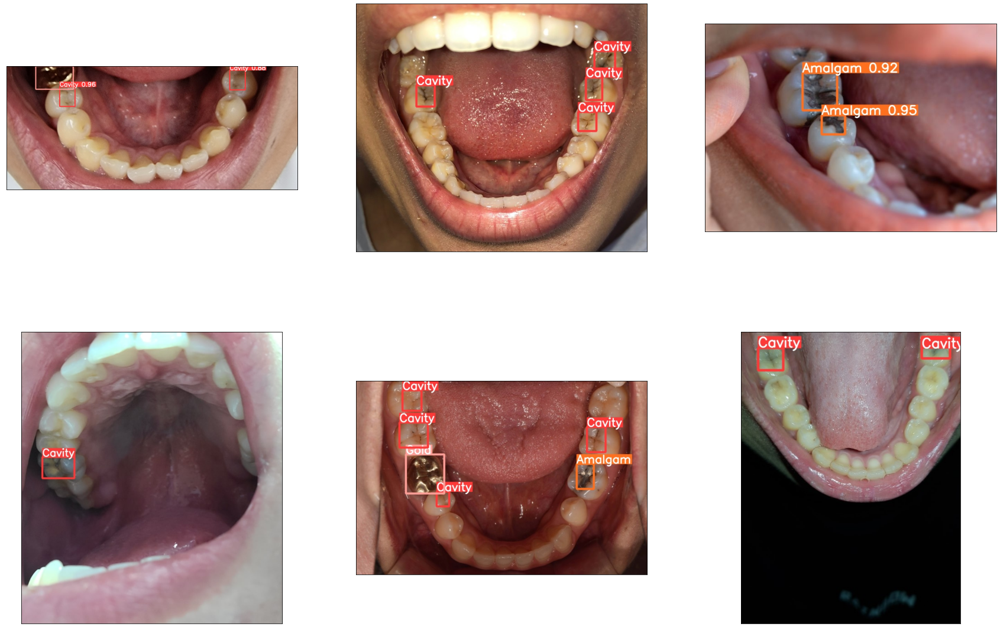

현대인의 충치, 치주염등 치아 관련 질병 발생이 시간이 지날수록 점차 증가하고 있다.</br>
2020년 한 해 동안 우리나라 국민 중 44.1%인 2,285만 명이 건강보험 치과 외래 진료를 받았으며, 1인당 평균 3.4일 방문하였다.


(데이터 링크 : http://www.hira.or.kr/bbsDummy.do;INTERSESSIONID=PkPJPr1oXaZW7ORJmLx2p61tA3Hz02RLQeDvSQ1-UGctmbkC-PIB!-366353795!-406590578?pgmid=HIRAA020041000100&brdScnBltNo=4&brdBltNo=10368&pageIndex=1 ) </br>
(이미지 링크 : http://www.dttoday.com/news/articleView.html?idxno=66789 )

#### 충치는 발치 신경치료의 상황까지 가기전 초기에 발견하여 치료하는것이 중요하다

# 1. 충치 판별 AI
---
### 1-1 : Dataset 의료용 데이터셋 확부 and 라벨링
### 1-2 : AI모델 학습
### 1-3 : 정확도 조절 
- batchSize조절, (train,validation)조절 등등

### 1-4 : Detect
사진 Detect 속도 : image 1/1 /workspace/ssddata/soongsil/songhunTest/detect_songhun.jpg: 288x640 2 Cavitys, 1 Gold, Done. (0.015s)


```python
import glob
import cv2
import matplotlib.pyplot as plt

fig=plt.figure(figsize=(30,20))
rows = 2
cols = 3
i = 1

for filename in glob.glob('./result_images/*.jpg'):
    img = cv2.imread(filename)
    ax = fig.add_subplot(rows,cols,i)
    ax.imshow(cv2.cvtColor(img,cv2.COLOR_BGR2RGB))
    ax.set_xticks([]), ax.set_yticks([])
    i +=1
    
plt.show()
```


    

    


####  - Cavity(충치), Amalgam(아말감), Gold(금)이 잘 detect됨을 확인했다. (정확도는 특정 이미지는 제거 특정 이미지는 추출)

# 2. 치석 판별 AI
---
### 2-1 : Dataset 의료용 데이터셋 확부 and 라벨링
### 2-2 : AI모델 학습

### 2-3 : Detect


#### 치석의 경우 데이터셋의 부족으로 인해 완벽한 학습을 하지 못하였다. 추후 수정예정


```python

```
